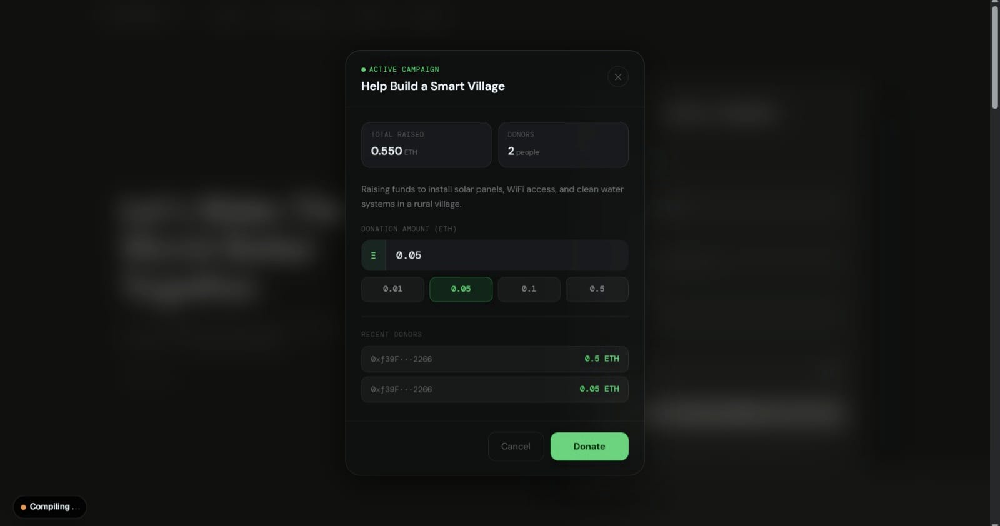
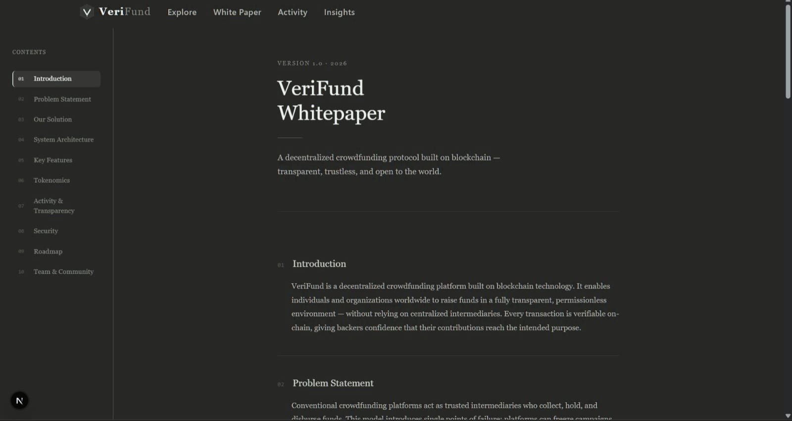
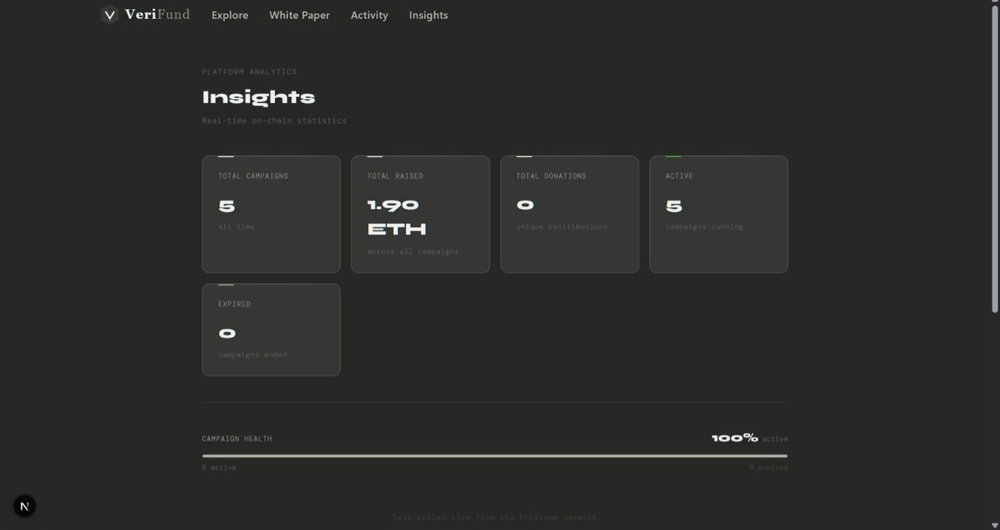
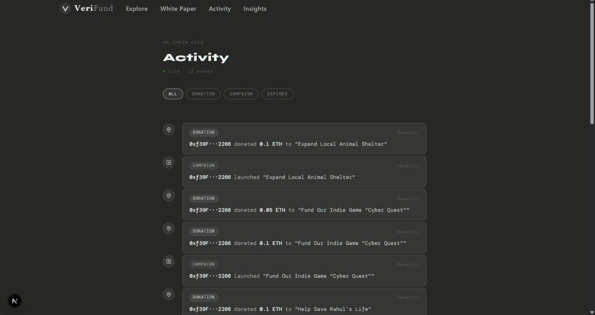

# 🚀 VeriFund — Decentralized Crowdfunding Platform

VeriFund is a **blockchain-powered crowdfunding platform** built on Ethereum, enabling individuals and organizations to raise funds transparently, securely, and without intermediaries.

---

## 🌍 Vision

> “Let’s make the world better together.”

VeriFund removes trust barriers by leveraging **smart contracts**, ensuring that every transaction is verifiable and funds are used as intended.

---

## ✨ Features

* 🔐 **Decentralized & Trustless**
* 💰 **Secure ETH Donations**
* 📊 **Real-time On-chain Analytics**
* 📢 **Campaign Creation & Management**
* 📜 **Transparent Activity Feed**
* ⚡ **Fast & Gas-optimized Transactions**

---

## 🖼️ Screenshots

### 🏠 Homepage


### 📝 Create Campaign


### 📢 All Campaigns


### 💸 Donation Modal



### 📄 WhitePaper



### 📊 Insights Dashboard



### 🔄 Activity Feed



---

## ⚙️ Tech Stack

| Layer              | Technology         |
| ------------------ | ------------------ |
| Frontend           | React.js / Next.js |
| Styling            | Tailwind CSS       |
| Blockchain         | Ethereum           |
| Smart Contracts    | Solidity           |
| Wallet             | MetaMask           |
| Backend (UI) | Firebase           |

---

## 🔗 Smart Contract Highlights

* Campaign creation with owner validation
* Fund tracking per campaign
* Secure donation handling
* Refund logic (if target not met)

---

## 🚀 Getting Started

### 1️⃣ Clone the repository

```bash
git clone https://github.com/your-username/verifund.git
cd verifund
```

### 2️⃣ Install dependencies

```bash
npm install
```

### 3️⃣ Run Frontend

```bash
npm run dev
```

### 4️⃣ Start Local Blockchain (if using Hardhat)

```bash
npx hardhat node

```
### 5️⃣ Deploy Smart Contract

```bash
npx hardhat run scripts/deploy.js --network localhost
```

---

## 🔐 Wallet Connection

* Install MetaMask
* Connect wallet using "Connect Wallet" button
* Ensure you're on Ethereum network

---

## 📈 Future Enhancements

* 🪙 Multi-chain support (Polygon, BSC)
* 📱 Mobile responsiveness improvements
* 🧾 NFT-based donation certificates
* 🛡️ Advanced fraud detection

---

## 🤝 Contributing

Contributions are welcome!
Feel free to fork this repo and submit a pull request.

---

## 📄 License

This project is licensed under the MIT License.

---

## 👨‍💻 Author

**Satyam Gagare**

---

## ⭐ Support

If you like this project, give it a ⭐ on GitHub!

---
